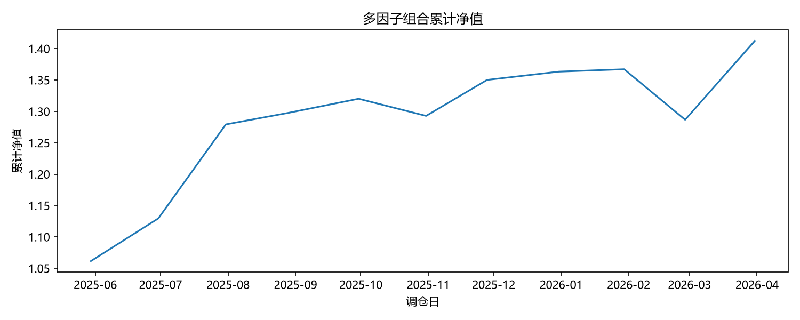
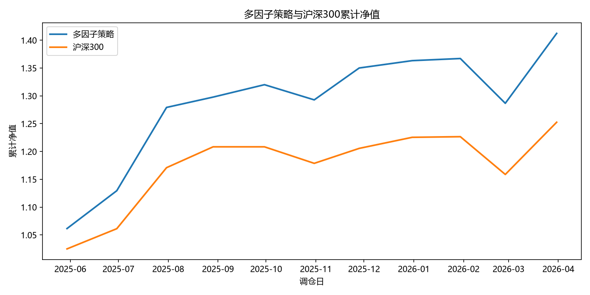
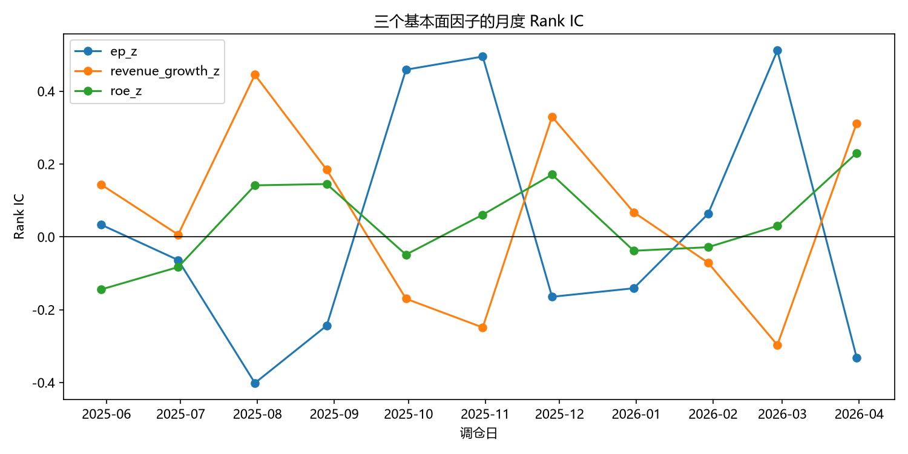
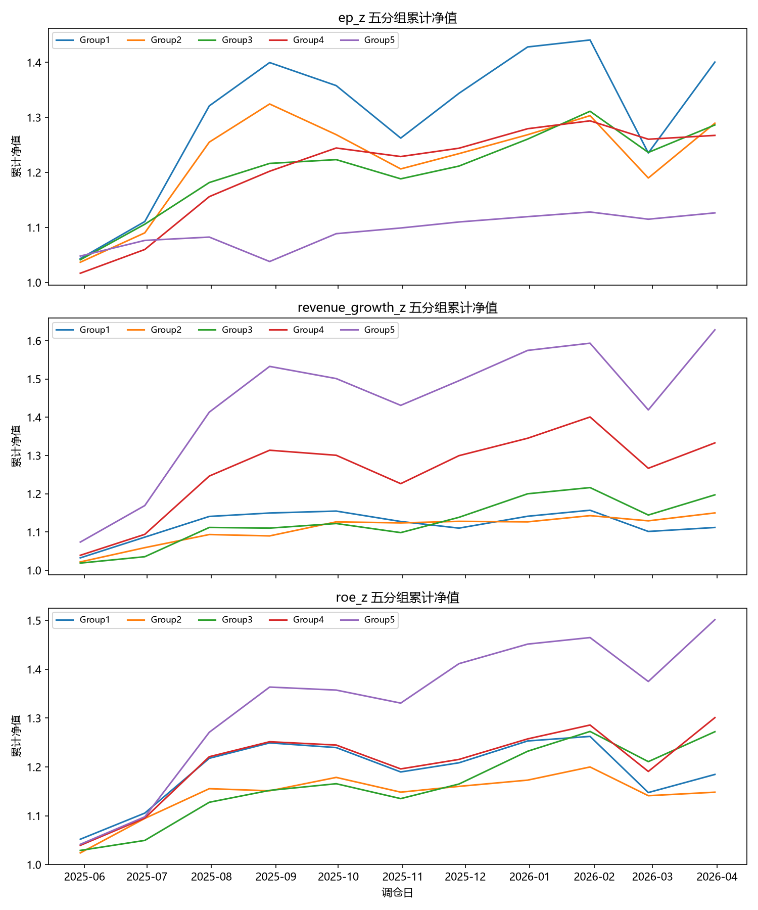
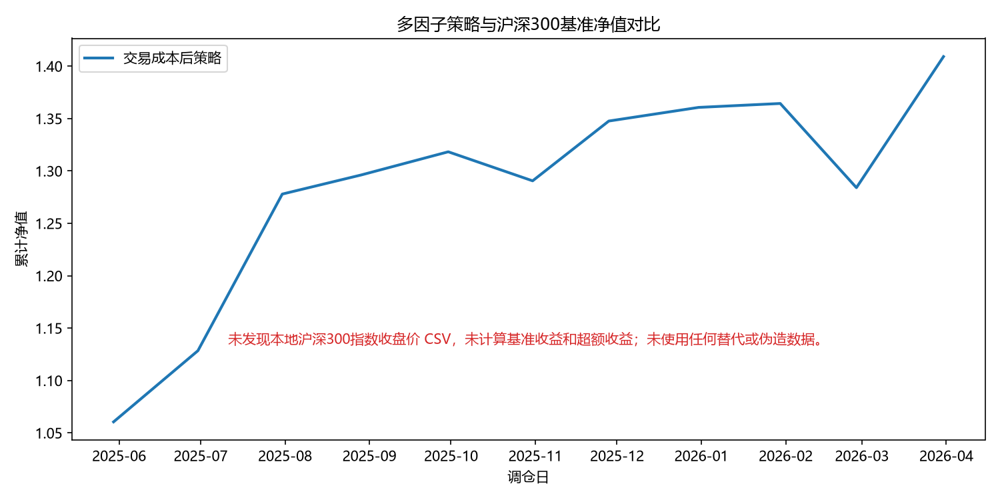
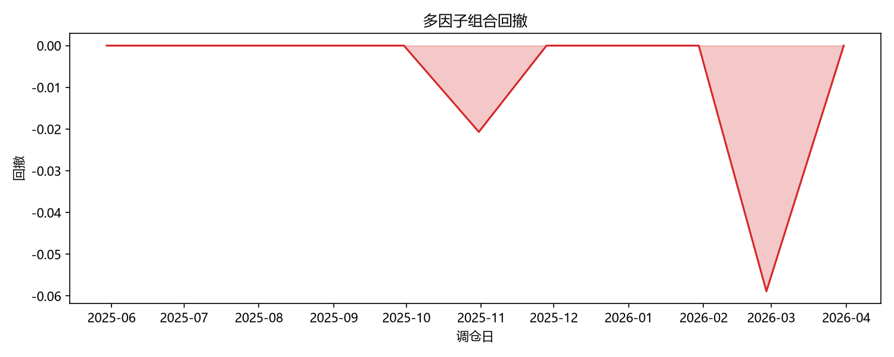
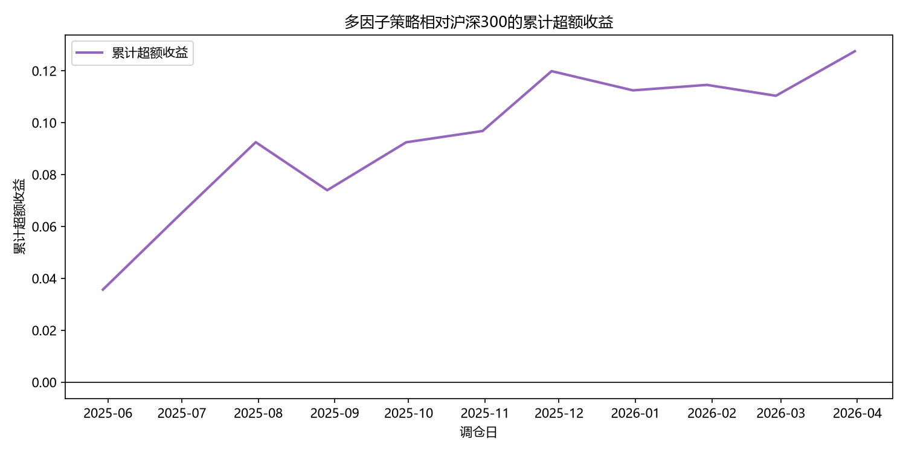

# A-Share Multi-Factor Quantitative Research Framework


A Python-based fundamental multi-factor quantitative research framework for the A-share market.

基于 Python 与 JQData 数据接口搭建的 A 股基本面多因子量化研究框架。

本项目完成完整量化研究流程：

**Data Acquisition → Data Cleaning → Factor Construction → IC Analysis → Portfolio Construction → Backtesting → Transaction Cost Simulation → Benchmark Comparison**


---

## Contents

- [Performance Overview](#1-performance-overview)
- [Research Background](#2-research-background)
- [Research Pipeline](#3-research-pipeline)
- [Data Description](#4-data-description)
- [Factor Model](#5-factor-model)
- [Factor Analysis](#6-factor-analysis)
- [Benchmark Comparison](#7-benchmark-comparison)
- [Risk Analysis](#8-risk-analysis)
- [Project Highlights](#project-highlights)
- [Project Structure](#9-project-structure)
- [Environment Setup](#10-environment-setup)
- [Run](#11-run)
- [Technology Stack](#12-technology-stack)
- [Limitations](#13-limitations)


---

# 1. Performance Overview

---

# 1. Performance Overview

## Strategy Performance


### Portfolio Net Value




### Strategy vs CSI300




## Key Results

回测周期：

**2025-05-30 ~ 2026-04-29**

交易频率：

**Monthly Rebalance**


| Metric | Result |
|---|---:|
| Annual Return | 45.38% |
| Annual Volatility | 18.76% |
| Sharpe Ratio | 2.11 |
| Maximum Drawdown | -5.89% |
| Average Monthly Turnover | 21.52% |


加入交易成本后：

- Cumulative Return: **40.91%**
- Sharpe Ratio: **2.11**
- Maximum Drawdown: **-5.89%**

结果显示策略在考虑交易成本后仍保持较稳定表现。


---

# 2. Research Background

基本面多因子模型是量化投资中常见的选股方法。

本项目基于沪深300股票池，选择：

- Valuation Factor（估值）
- Profitability Factor（盈利能力）
- Growth Factor（成长性）

构建综合评分模型。

主要研究：

- 单因子预测能力
- 多因子组合收益表现
- 风险收益特征
- 换手率影响
- 交易成本影响
- 相对于沪深300指数的超额收益


---

# 3. Research Pipeline


```
JQData Data Acquisition

        ↓

Data Cleaning

        ↓

Factor Construction

        ↓

IC Analysis

        ↓

Single Factor Portfolio Test

        ↓

Multi-Factor Portfolio Construction

        ↓

Backtesting

        ↓

Transaction Cost Simulation

        ↓

CSI300 Benchmark Comparison

        ↓

Visualization
```


---

# 4. Data Description


| Item | Description |
|-|-|
| Data Source | JQData |
| Stock Pool | CSI 300 Constituents |
| Frequency | Monthly Rebalance |
| Period | 2025-05-30 ~ 2026-04-29 |
| Stocks | 300 CSI300 Stocks |
| Records | 3600 Stock-Month Observations |


---

# 5. Factor Model


The model uses three fundamental factors:


| Factor | Description |
|-|-|
| PE Ratio | Valuation Factor |
| ROE | Profitability Factor |
| Revenue Growth | Growth Factor |


Factor score:


```
Composite Score =
PE Score
+
ROE Score
+
Revenue Growth Score
```


Portfolio construction:

1. Calculate factor scores
2. Rank stocks by composite score
3. Select high-score stocks
4. Construct equal-weight portfolio
5. Monthly rebalance


---

# 6. Factor Analysis


## IC Analysis


Information Coefficient (IC) is used to evaluate factor predictive ability.


Analysis:

- IC Mean
- IC Stability
- Factor Direction





## Portfolio Group Test


Stocks are divided into five groups according to factor scores.


Low Score

↓

High Score


The return spread is used to evaluate factor effectiveness.





---

# 7. Benchmark Comparison


Benchmark:

**CSI 300 Index (000300.XSHG)**


Benchmark process:

1. Download CSI300 daily close price from JQData
2. Match monthly rebalance dates
3. Calculate benchmark return
4. Compare strategy performance





---

# 8. Risk Analysis


## Drawdown Analysis





## Excess Return Analysis





---

# 9. Project Structure


```
A-Share-MultiFactor-Research

├── main.py
├── run_all.py

├── data_fetch.py
├── data_cleaner.py

├── factor_process.py
├── ic_analysis.py

├── backtest_group.py
├── multifactor.py
├── backtest_portfolio.py

├── turnover_calculator.py

├── benchmark.py
├── benchmark_analysis.py

├── visualization.py

├── requirements.txt

└── README.md
```


---

# 10. Environment Setup


Python:

```
Python 3.10+
```


Install dependencies:


```bash
pip install -r requirements.txt
```


Configure JQData:


Create `.env`:


```
JQDATA_USERNAME=your_username

JQDATA_PASSWORD=your_password
```


---

# 11. Run


Execute:


```bash
python run_all.py
```


The framework automatically completes:


- Data acquisition
- Data cleaning
- Factor processing
- IC analysis
- Portfolio backtesting
- Transaction cost simulation
- Benchmark comparison
- Visualization


---

# 12. Technology Stack


| Category | Tools |
|-|-|
| Language | Python |
| Data Processing | Pandas, NumPy |
| Data Source | JQData |
| Backtesting | Custom Python Framework |
| Visualization | Matplotlib |


---

# Project Highlights


## Complete Quantitative Research Pipeline


This project implements an end-to-end quantitative research workflow:


- Market data acquisition through JQData
- Data cleaning and quality checking
- Fundamental factor construction
- Factor preprocessing and normalization
- IC-based factor evaluation
- Quintile portfolio testing
- Multi-factor score construction
- Portfolio backtesting
- Turnover calculation
- Transaction cost simulation
- CSI300 benchmark comparison
- Performance visualization


## Modular Framework Design


The project adopts a modular architecture:


```
Data Module

    ↓

Factor Module

    ↓

Portfolio Module

    ↓

Backtest Module

    ↓

Analysis Module

    ↓

Visualization Module
```


Each module is independently implemented, making the research process easier to maintain and extend.


## Research Insights


The strategy combines three types of fundamental signals:


| Factor | Investment Logic |
|-|-|
| PE Ratio | Valuation factor |
| ROE | Profitability factor |
| Revenue Growth | Growth factor |


The project evaluates factor effectiveness through:

- IC analysis
- Portfolio group testing
- Multi-factor portfolio performance
- Risk-adjusted return analysis


Meanwhile, transaction costs and benchmark performance are considered to make the backtest closer to real investment scenarios.

# 13. Limitations


The current research period is relatively short.

The backtest results are mainly used to verify the research framework and modeling process.

They should not be interpreted as guaranteed future investment performance.


---

# Author


**Ma Yanlong**

International Economics and Trade

Python Quantitative Research / Data Analysis
